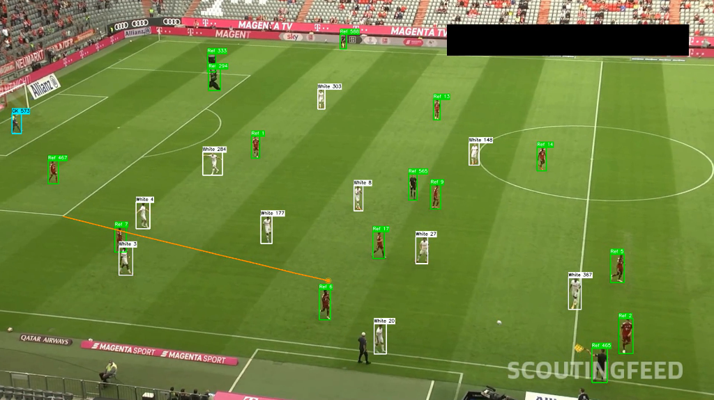
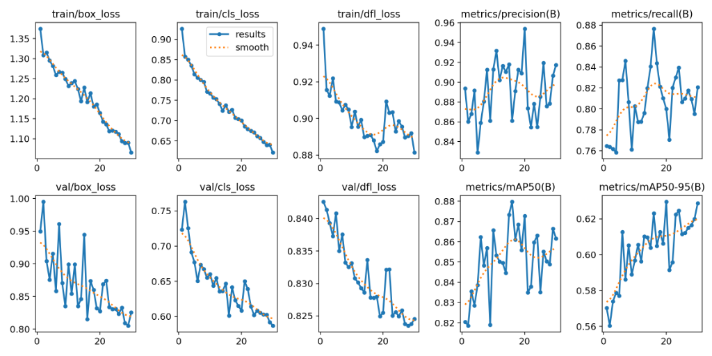
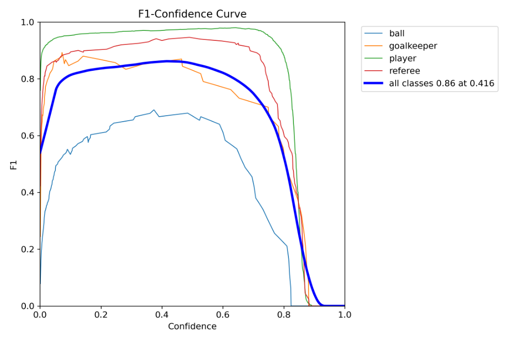
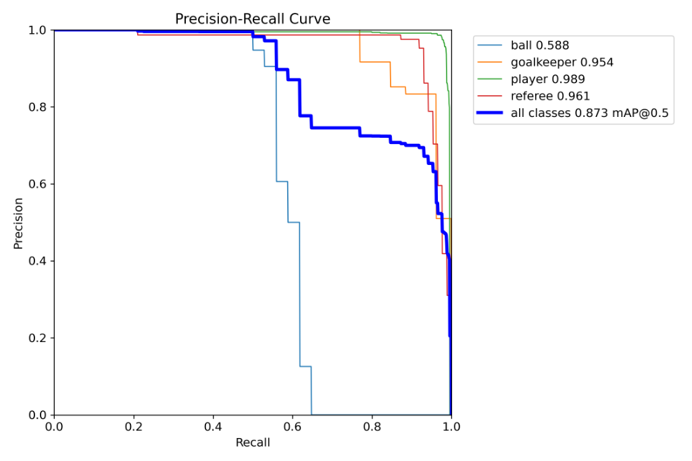
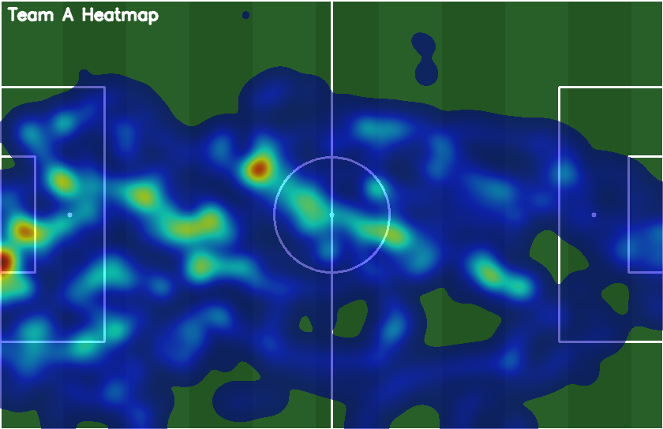
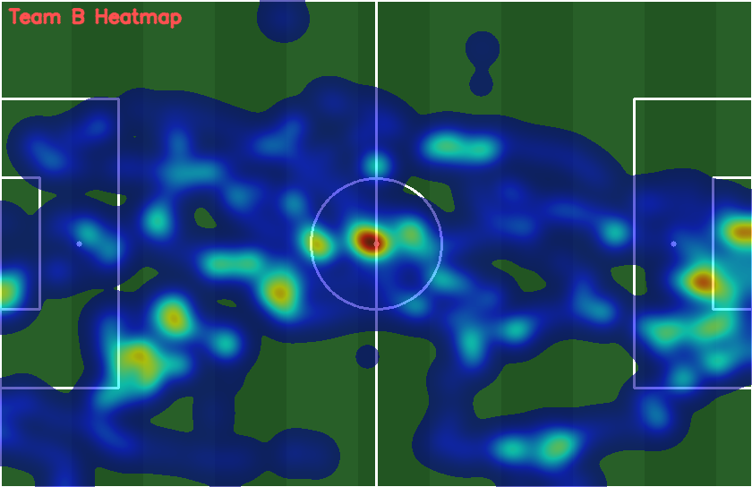

# ScoutingFeed: AI-Powered Football Analytics & Player Tracking System

> **A comprehensive computer vision pipeline that transforms raw broadcast match video into 2D top-down tactical heatmaps, player statistics, and game event logs.**

---

## 📺 Visual Preview

| Play Phase: Midfield Transition (Frame 282) | Defensive Structure (Frame 557) |
| :---: | :---: |
|  |  |

---

## 🚀 Key Features

* **Advanced Object Detection**: Dual-pass YOLO11m architecture customized for high-speed tracking and tiny-object (ball) recovery.
* **Stable Multi-Object Tracking**: Integration of ByteTrack to maintain persistent player track IDs during dense scrums and physical occlusions.
* **Zero-Shot Team Classification**: Dominant-color clustering via HSV K-Means, automatically separating home and away kits under varying lighting conditions.
* **Perspective Homography Projection**: RANSAC-estimated matrix projection mapping pixel coordinates to real-world FIFA pitch meter dimensions ($105\text{m} \times 68\text{m}$).
* **Linear Trajectory Smoothing**: 4D Kalman filter state estimator predicting ball movement during player-ball overlaps and broadcast camera cuts.
* **Tactical Analytics**: Real-time event log mapping ball possession, pass completion rates, and defensive interceptions.
* **Interactive Dark-Mode Dashboard**: Self-contained analytics client showing possession split, distance covered, top speed charts, and team heatmaps.

---

## 📊 Model Training & Evaluation Metrics

We custom-trained the detection network in two stages to address standard football broadcast challenges:

1. **Baseline Run** (`yolo11m_baseline-4`): 20 epochs, 640px resolution (overall mAP50: **0.821**).
2. **Improved Run** (`yolo11m_v2_improved`): 35 epochs, 1280px high-resolution input, AdamW optimizer, and optimized class-weighting penalizing missed ball detections.

### Final Validation Performance (v2 Improved Model)

| Class | Precision | Recall | mAP50 | mAP50-95 |
| :--- | :---: | :---: | :---: | :---: |
| **All Classes** | **0.954** | **0.800** | **0.873** | **0.629** |
| **Player** | 0.962 | 0.982 | **0.989** | 0.805 |
| **Referee** | 0.960 | 0.919 | 0.961 | 0.659 |
| **Goalkeeper** | 0.982 | 0.769 | 0.954 | 0.766 |
| **Ball** | 0.913 | 0.529 | **0.588** | 0.285 |

### Metrics Visualization

#### 📈 Training Progress and Loss Curves
We tracked our bounding box, classification, and distribution focal losses over time. The box loss shows strong convergence down to `1.08`.



#### 🎯 F1-Confidence and Precision-Recall Curves
At a confidence threshold of **`0.416`**, the model achieves a peak F1 score of **`0.86`** across all classes, indicating highly stable player bounding box predictions.




---

## 📍 Tactical Positional Heatmaps

Positional coordinate arrays projected via the homography mapping are passed through a Gaussian density accumulator ($\sigma = 1.5\text{m}$) to generate tactical pitch density overlays showing player spatial distribution.

| Team A (White Jerseys) Positional Density | Team B (Red Jerseys) Positional Density |
|:---:|:---:|
|  |  |

---

## 🛠️ The 9-Stage Pipeline Architecture

```
                               ┌─────────────────────────┐
                               │     Raw Match Video     │
                               └────────────┬────────────┘
                                            │
                                            ▼
                               ┌─────────────────────────┐
                               │ 1. YOLO11m Detection    │
                               └────────────┬────────────┘
                                            │
                                            ▼
                               ┌─────────────────────────┐
                               │ 2. ByteTrack Tracking   │
                               └────────────┬────────────┘
                                            │
                                            ▼
                               ┌─────────────────────────┐
                               │ 3. HSV K-Means Class.   │
                               └────────────┬────────────┘
                                            │
                                            ▼
                               ┌─────────────────────────┐
                               │ 4. RANSAC Homography    │
                               └────────────┬────────────┘
                                            │
                                            ▼
                               ┌─────────────────────────┐
                               │ 5. Kalman Ball Filter   │
                               └────────────┬────────────┘
                                            │
                                            ▼
                               ┌─────────────────────────┐
                               │ 6. Possession Logic     │
                               └────────────┬────────────┘
                                            │
                                            ▼
                               ┌─────────────────────────┐
                               │ 7. Pass Event Tracker   │
                               └────────────┬────────────┘
                                            │
                                            ▼
                               ┌─────────────────────────┐
                               │ 8. Heatmap Generator    │
                               └────────────┬────────────┘
                                            │
                                            ▼
                               ┌─────────────────────────┐
                               │ 9. Visual HUD Overlay   │
                               └────────────┬────────────┘
                                            │
                                            ▼
                               ┌─────────────────────────┐
                               │ Interactive Dashboard   │
                               └─────────────────────────┘
```

### 1. Object Detection (YOLO11m)
Detects players, referees, goalkeepers, and the ball in parallel.
### 2. Multi-Object Tracking (ByteTrack)
Utilizes the low-confidence association logic of ByteTrack to handle brief visual overlaps when players run behind each other.
### 3. Team Classification
Crops the upper 45% of the player bounding box, filters out the green grass background in HSV color space, and clusters the dominant kit colors using K-Means ($k=2$).
### 4. Homography Projection
Applies a smoothed perspective mapping matrix to transform frame pixel positions into real-world coordinate meters.
### 5. Ball Smoothing (Kalman Filter)
Maintains state estimation using a constant-velocity vector. We employ a hybrid model: we draw the raw coordinates directly during active detection, and smoothly project predictions during short occlusions.
### 6. Temporal Window Possession
A sliding 8-frame majority vote assigns possession only when the ball is consistently closest to a specific player ID, preventing flickering state changes.
### 7. Pass & Interception Tracker
Detects passing events by monitoring transition changes in possession ownership, categorizing them as successful or intercepted.
### 8. Heatmap Accumulator
Creates 2D Gaussian density arrays on a standard pitch canvas.
### 9. Composition Overlay
Renders the side-by-side video stream alongside a live bird's-eye minimap of the field.

---

## 📂 Project Structure

```text
football-tracking-system/
├── run_pipeline.py              ← Main integrated pipeline script (Stages 1-9)
├── generate_dashboard.py        ← Builds the self-contained dashboard client
├── dashboard_standalone.html    ← Output: Standalone analytics dashboard UI
│
├── src/
│   ├── calibration/
│   │   ├── homography.py        ← RANSAC matrix calculation and smoothing
│   │   └── pitch_projection.py  ← Pixel-to-meters projection and speed logs
│   ├── team_classification/
│   │   └── color_classifier.py  ← HSV jersey kit color grouping
│   ├── tracking/
│   │   ├── bytetrack_wrapper.py ← ByteTrack wrappers
│   │   └── kalman_ball_filter.py← Ball Kalman state space model
│   ├── possession/
│   │   └── temporal_window.py   ← Possession voting and pass state machine
│   ├── stats/
│   │   └── player_stats.py      ← Match statistics calculator
│   └── viz/
│       ├── heatmap.py           ← 2D Gaussian density compiler
│       └── minimap.py           ← Bird's-eye canvas overlay generator
│
├── assets/                      ← README metrics and visual assets
├── configs/train/               ← YAML configs for YOLO11m v1/v2 models
└── data/processed/              ← Cleaned YOLO format training datasets
```

---

## 🛠️ Installation & Setup

### 1. Environment Setup
We recommend using **Miniconda** to manage your CUDA GPU environment:
```bash
# Create the environment from standard requirements
conda create -n ai python=3.11 -y
conda activate ai

# Install standard dependencies
pip install -r requirements.txt
```

### 2. Configure Your Video Source
Open `run_pipeline.py` and modify the input configuration parameters:
```python
# run_pipeline.py
VIDEO_PATH   = "Copy of A1606b0e6_0 (23).mp4" # Target input video
OUTPUT_VIDEO = "output_full_pipeline.mp4"      # Combined video/minimap output
```

### 3. Run the Integrated Tracking Pipeline
Execute the master pipeline to run all tracking and analytics modules:
```bash
python run_pipeline.py
```

### 4. Open the Interactive Dashboard
Build the standalone HTML file (which embeds all stats JSON and heatmaps inline, resolving local browser CORS issues) and open it:
```bash
python generate_dashboard.py
```

---

## 🏆 Standalone Match Dashboard Overview
The dashboard compiled in `dashboard_standalone.html` reads your local run metrics and generates:
- **Doughnut Charts** displaying possession splits.
- **Top Speed and Distance Covered Charts** mapping performance across all track IDs.
- **Heatmap Tabs** showing positional distributions.
- **Filterable Performance Tables** which can be grouped by teams.

*Double-click `dashboard_standalone.html` to open it locally on any browser.*
